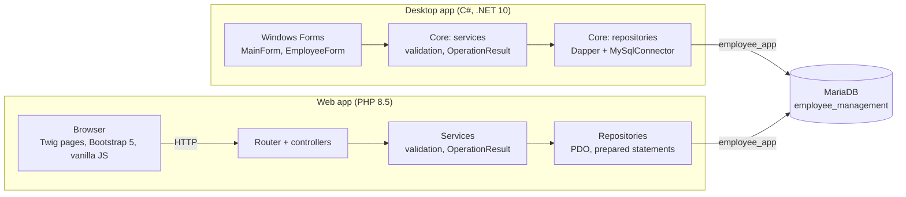
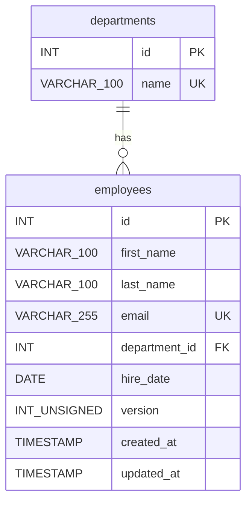
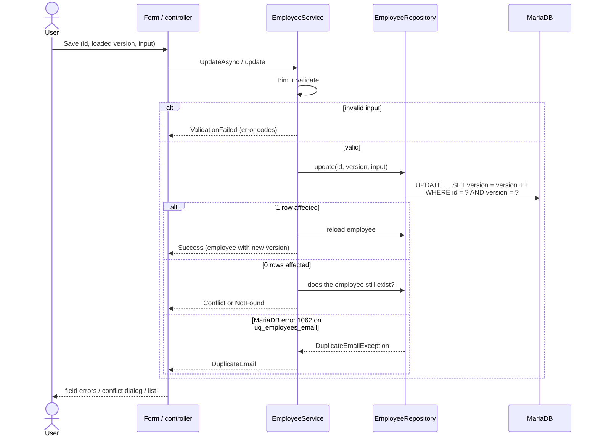

# Architecture

Two independent applications manage the same employees in one MariaDB database. They share
no code and no service – only the schema and the same rules. This document gives the overall
picture; the reasoning behind individual decisions is in the
[architecture decision records](decisions/).

## Overview

| | Desktop | Web |
|---|---|---|
| UI | Windows Forms (`Forms/`), styling in `Styling/` | Twig templates, Bootstrap 5, small JS files |
| Entry point | `Program.cs`: DI host (`Microsoft.Extensions.Hosting`), configuration, Serilog | `public/index.php`: front controller, PHP-DI container, own `Router` |
| Business logic | `EmployeeManagement.Core/Services` | `src/Services` |
| Data access | `EmployeeManagement.Core/Repositories` (Dapper, [ADR 0010](decisions/0010-data-access-with-dapper.md)) | `src/Repositories` (PDO) |
| Texts | `Resources/Strings.resx` | `lang/de.php` |
| Logging | Serilog, `logs/` next to the executable | Monolog, `web/var/log/` |
| Tests | xUnit v3 on the Core project | PHPUnit, PHPStan level 8 |

## Layers

Both apps use the same three layers, with the same class names on both sides
(`EmployeeService`, `EmployeeValidator`, `EmployeeRepository`, `OperationResult`,
`ValidationError`, `EmployeeQuery` …), so the implementations can be compared side by side.

- **UI / controllers** show data and collect input. They never talk to the database and
  never decide business rules; they map results to texts and dialogs.
- **Services** trim and validate input, call the repository and turn every expected outcome
  into an `OperationResult`: `Success`, `ValidationFailed` (with error codes),
  `DuplicateEmail`, `Conflict` or `NotFound`. Exceptions are reserved for unexpected errors
  such as an unreachable database ([ADR 0005](decisions/0005-validation-and-operation-results.md)).
- **Repositories** contain all SQL. They translate MariaDB errors into domain exceptions
  (duplicate email, missing department), so services stay independent of the database driver.

On the desktop side, business logic and data access live in `EmployeeManagement.Core`, a plain
`net10.0` library without any Windows Forms reference. It cannot depend on the UI and is
tested on its own ([ADR 0001](decisions/0001-desktop-project-structure.md)). The web app follows
the same split inside one Composer project ([ADR 0007](decisions/0007-web-application-structure.md)).

## Data model

- Departments are a separate, fixed table with a foreign key (`ON DELETE RESTRICT`), so a
  department cannot be misspelled and the filter lists exactly the existing ones
  ([ADR 0002](decisions/0002-departments-table.md)).
- `utf8mb4` with the accent- and case-insensitive collation `utf8mb4_uca1400_ai_ci`: searching
  for `muller` finds `Müller`, and `Max@example.com` counts as a duplicate of `max@example.com`.
- The database itself enforces what must never be violated: unique email, required columns
  (`NOT NULL` and `CHECK` against blank values), valid department.
- `database/setup.sql` creates everything, including sample data and the restricted user
  `employee_app` ([ADR 0008](decisions/0008-database-application-user.md)).

## Saving an employee

The same flow runs in both apps. The interesting cases are the ones where another user was
faster.

- **Optimistic concurrency:** every update increments `version`; updates and deletes only
  match the version the user loaded. A conflict is never overwritten silently – the user can
  reload the current data or keep their input. A conflicting delete is not executed
  ([ADR 0003](decisions/0003-optimistic-concurrency.md)).
- **Unique email:** the unique index is the real guarantee. A check before saving would still
  lose a race between two users, so the duplicate-key error itself is turned into a friendly
  message on the email field.

## Listing employees

Search, department filter, sorting and paging run in the database; only one page is loaded
([ADR 0004](decisions/0004-search-sorting-paging.md)).

- Prefix search (`LIKE 'term%'`) on first name, last name and email, so the indexes are used;
  several words narrow the result. User wildcards are escaped.
- `ORDER BY` comes from a fixed mapping of an enum; user input never reaches the SQL text.
- Both apps search while typing and reload the shown page every 30 seconds and when their
  window becomes active, so changes made in the other app appear without a manual refresh.
  Polling was chosen over push because MariaDB cannot notify clients
  ([ADR 0009](decisions/0009-live-search-and-list-refresh.md)).
- The web list keeps its state (search, filter, sorting, page) in the URL. Without JavaScript
  every interaction falls back to a full page load.

## Cross-cutting concerns

**Validation.** The same rules in both apps: names required and at most 100 characters, email
required, at most 255 characters and the same simple pattern, department required, hire date
between 1950-01-01 and one year from today. Validators return language-neutral codes; each UI
maps them to its own texts. The UIs only pre-check required fields to enable the save button –
the services validate every request.

**Error handling.** Expected outcomes are results, not exceptions. Unexpected errors are logged
with their stack trace and shown as a friendly message: a dialog in the desktop app, an error
page in the web app. A missing configuration or an unreachable database is reported the same
way instead of crashing. Background reloads only log, so a database outage does not produce a
dialog every 30 seconds.

**Logging.** Serilog and Monolog write daily files and keep 14 of them. Log messages contain
employee ids only – no names or email addresses, as these are personal data
([ADR 0006](decisions/0006-logging-with-serilog.md)).

**Security.**

| Risk | Protection |
|---|---|
| SQL injection | Parameters only (Dapper, PDO with real prepared statements); sort columns from a fixed mapping |
| Cross-site scripting | Twig auto-escaping; JavaScript writes user data with `textContent` |
| Cross-site request forgery | Synchronizer token on every POST, compared with `hash_equals`; nothing changes on GET |
| Session theft | Session cookie `HttpOnly`, `SameSite=Lax`, strict mode |
| Tampered CDN files | Subresource Integrity hashes for Bootstrap |
| Excessive database rights | Apps connect as `employee_app`: read/write employees, read departments only |
| Open redirect | Return URLs are rebuilt from parsed list parameters, never taken from the request |

The development password of `employee_app` is committed on purpose so that the apps run right
after the setup script; this is acceptable for a local demo only
([ADR 0008](decisions/0008-database-application-user.md)).

## Testing and CI

- **Desktop:** xUnit v3 tests for validation, the service layer (with an in-memory repository
  and `FakeTimeProvider`), query building, LIKE escaping and the page comparison used by the
  background refresh. The Windows Forms project is not unit-tested.
- **Web:** PHPUnit tests for the same rules plus routing, CSRF protection, flash messages,
  translation and the parsing of list parameters; PHPStan at level 8.
- Neither test suite needs a database. The SQL itself is exercised by the CI database job and
  by running the apps.
- **GitHub Actions** ([`.github/workflows/ci.yml`](../.github/workflows/ci.yml)) runs three
  jobs on every push and pull request: desktop build with warnings as errors plus tests on
  Windows, web checks on Linux, and a MariaDB 13 container that runs `setup.sql` twice and
  checks the rights of `employee_app`. Pull requests to `main` require all three.

## Decision records

| ADR | Topic |
|---|---|
| [0001](decisions/0001-desktop-project-structure.md) | Desktop solution with Desktop, Core and Core.Tests projects |
| [0002](decisions/0002-departments-table.md) | Departments as a separate table |
| [0003](decisions/0003-optimistic-concurrency.md) | Optimistic concurrency with a version column |
| [0004](decisions/0004-search-sorting-paging.md) | Search, sorting and paging in the database |
| [0005](decisions/0005-validation-and-operation-results.md) | Validation codes and operation results |
| [0006](decisions/0006-logging-with-serilog.md) | Logging with Serilog |
| [0007](decisions/0007-web-application-structure.md) | Web application structure without a framework |
| [0008](decisions/0008-database-application-user.md) | Database application user with a development password |
| [0009](decisions/0009-live-search-and-list-refresh.md) | Live search and keeping the list up to date |
| [0010](decisions/0010-data-access-with-dapper.md) | Data access with Dapper instead of EF Core |
